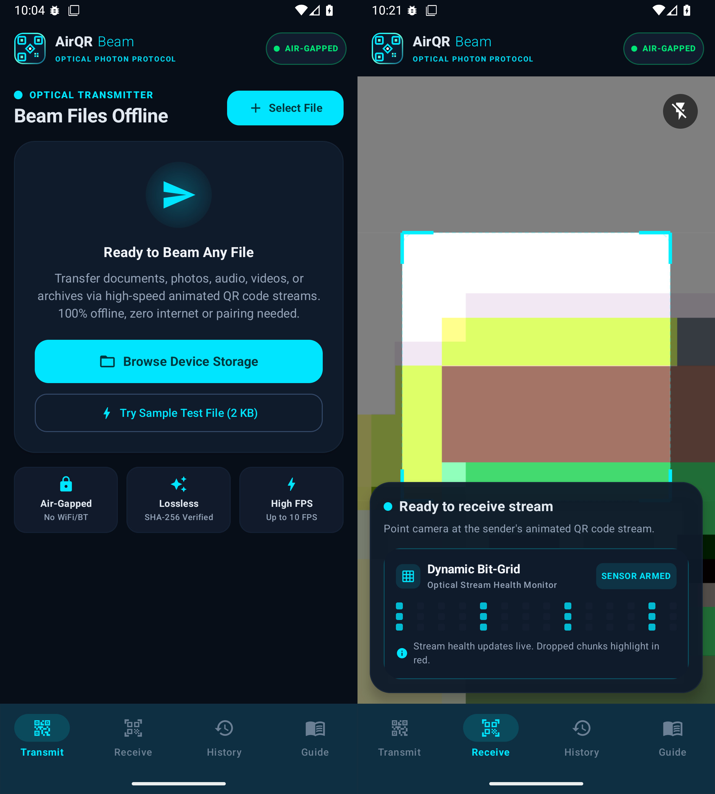

# ⚡ AirQR Beam — Optical Photon Air-Gapped File Transfer

<p align="center">
  
  
  
  
</p>

<p align="center">
  <a href="https://github.com/prajwal032004/qr-optical-beam/stargazers"></a>
  <a href="https://github.com/prajwal032004/qr-optical-beam/network/members"></a>
  <a href="LICENSE"></a>
  <a href="https://kotlinlang.org/"></a>
  <a href="https://developer.android.com/jetpack/compose"></a>
</p>

<h3 align="center">
  <b>Simplex high-frequency optical data transmission across physically isolated, air-gapped devices via animated QR streams.</b>
</h3>

<p align="center">
  <b>Zero Wi-Fi • Zero Bluetooth • Zero Cellular • Zero NFC • Zero Cloud Servers • 100% RF-Silent</b>
</p>

<p align="center">
  <a href="https://github.com/prajwal032004/qr-optical-beam/releases/download/v1.0.0/app-debug.apk">
    
  </a>
  <a href="https://github.com/prajwal032004/qr-optical-beam/releases/tag/v1.0.0">
    
  </a>
</p>

---

## 📸 Preview & User Interface

<p align="center">
  
</p>

<p align="center">
  <i>Left: High-Speed Optical Stream Transmitter (Tx) with configurable FPS & chunking.<br/>
  Right: Machine Vision Receiver (Rx) with the real-time <b>Dynamic Bit-Grid</b> stream health monitor.</i>
</p>

---

## 💡 What is AirQR Beam?

**AirQR Beam** turns your device screen and camera into a high-throughput, unidirectional optical data bus. 

Traditional file transfer tools (AirDrop, Bluetooth, Quick Share, Wi-Fi Direct) emit radio frequency (RF) signals that can be sniffed, jammed, intercepted, or tracked. In high-security enclaves, defense setups, cryptocurrency key migration, or disaster zones with zero signal, RF connectivity is forbidden or non-existent.

**AirQR Beam solves this by transmitting data purely through visible light (photons):**
1. Any file on the transmitter device is sliced into numbered packet frames and encoded into high-density dynamic QR codes.
2. The display animates through the frames at **10 to 25 FPS**.
3. The receiver's camera captures the stream in real-time with sub-frame computer vision decoding.
4. If packets drop due to glare or angle, a **Reverse Optical NACK Request QR** allows the receiver to request *only the missing packets*—achieving 100% lossless transmission with zero radio waves!

---

## ⚔️ Why AirQR Beam vs Traditional File Sharing?

| Feature | ⚡ AirQR Beam | 📡 Bluetooth | 📶 Wi-Fi Direct / AirDrop | ☁️ Cloud / Telegram |
| :--- | :---: | :---: | :---: | :---: |
| **Air-Gap Compliance** | ✅ **100% Strict** | ❌ No (RF active) | ❌ No (RF active) | ❌ No (Internet req.) |
| **Radio Emissions (RF Signature)** | 🔇 **Zero (Photons only)** | ⚠️ High 2.4 GHz | ⚠️ High 2.4/5 GHz | ⚠️ High Cellular/Wi-Fi |
| **Faraday Cage & SCIF Operable** | ✅ **Yes** | ❌ Blocked | ❌ Blocked | ❌ Blocked |
| **Pairing & Discovery Handshake** | ⚡ **None (Point & Beam)** | ⏳ Slow pairing PINs | ⏳ Discovery handshake | ⏳ Login & Account |
| **Interception Risk** | 🛡️ **Line-of-Sight Only** | ⚠️ Wall penetration | ⚠️ Long range eavesdrop | ⚠️ Server & ISP logs |
| **Cross-Platform Companion** | 🌐 **Built-in Web Engine** | ❌ OS locks | ❌ Vendor locked | ⚠️ Needs third-party app |
| **Integrity Guarantee** | 🔒 **CRC32 + SHA-256** | ⚠️ Protocol dependent | ⚠️ Protocol dependent | ⚠️ Black box |

---

## 🔬 How It Works (Protocol Deep Dive)

```
       TRANSMITTER (Tx)                                         RECEIVER (Rx)
 [ Select Document / Binary ]                               [ Point Camera at Display ]
              │                                                          │
              ▼                                                          │
   1. SHA-256 File Hash Computed                                         │
   2. Sliced into 256B-1KB Chunks                                        │
   3. Framed: [ID, Index, Total, CRC, Base64]                            │
              │                                                          │
              ▼                                                          │
   4. High-Frequency Optical Animation                                   │
      (10 - 25 FPS Dynamic QR Stream)                                    │
              │                                                          │
      ░░░░░░░░░░░░░░░   Visible Light Photons (Display -> Lens)   ░░░░░░░│░░░
              └─────────────────────────────────────────────────────────►│
                                                                         ▼
                                                            5. CameraX & ML Kit Vision
                                                               Sub-frame Ingestion
                                                                         │
                                                                         ▼
                                                            6. Live Dynamic Bit-Grid
                                                               [ 🟩 Ingested | 🟥 Missing ]
                                                                         │
    OPTIONAL REVERSE PACKET NEGOTIATION (NACK)                           │
   ◄─────────────────────────────────────────────────────────────────────┘
      Receiver generates Compact Request QR for missing indices only:
      {"t":"req","id":"ab12cd","need":[4,12,19]}
              │
              ▼
   7. Transmitter scans Request QR
      & Beams ONLY missed packets!
              │
              └─────────────────────────────────────────────────────────►
                                                                         ▼
                                                            8. Atomic Reassembly
                                                            9. SHA-256 Hash Verified
                                                           10. Saved via Android SAF
```

### 1. High-Frequency Photon Stream
The transmitter renders ZXing-powered QR codes at precise clock intervals (10 FPS, 15 FPS, or 25 FPS). Error correction levels (ECC Low, Medium, Quartile, High) can be tuned according to ambient lighting and camera quality.

### 2. Machine Vision CameraX Ingestion
The receiving Android app leverages **Android CameraX** paired with **Google ML Kit Vision Barcode Scanning**, running hardware-accelerated detection at up to 60 FPS analysis rates with zero frame-buffer lockups.

### 3. Dynamic Bit-Grid & Telemetry
A live visual matrix maps every chunk of the transfer:
- 🟩 **Emerald Dots**: Successfully captured and validated chunks.
- 🟥 **Crimson Dots**: Dropped or skipped frames (caused by motion blur or glare).
- **Stream Health Indicator**: Live percentage calculating current packet yield.

### 4. Smart Optical NACK Negotiation
Instead of forcing the user to replay the entire file stream if 2 or 3 frames were dropped, the receiver calculates missing indices and renders a micro-QR request:
```json
{
  "t": "req",
  "id": "a3f81e",
  "need": [4, 19, 32]
}
```
The transmitter scans this request using its own camera and immediately broadcasts a targeted burst containing *only* those missing frames.

### 5. Atomic Cryptographic Verification
Once all chunks arrive, the engine reassembles the binary in memory, computes a clean **SHA-256 digest**, and verifies it against the header hash before committing to disk via Android's Storage Access Framework (SAF).

---

## ✨ Features

- ⚡ **Zero Network Required**: Operates completely in Airplane Mode or within RF-shielded rooms.
- 🎯 **High-Speed Transmission**: Adaptive speeds (`10 FPS Smooth`, `15 FPS Balanced`, `25 FPS Turbo`).
- 📊 **Dynamic Bit-Grid HUD**: Real-time visual progress showing captured, missing, and corrupted chunks.
- 🔄 **Bidirectional NACK Retransmit**: Smart optical handshaking to beam only missed packets.
- 🔒 **End-to-End Cryptographic Checksum**: SHA-256 whole-file hashing ensures 0-byte corruption.
- 📁 **Universal File Support**: Send photos, PDFs, compressed archives (.zip, .tar.gz), text files, cryptographic keys, and raw binaries.
- 📜 **Transfer History & SQLite Audit**: Full historical log powered by Android Room with timestamps, speed metrics, file hashes, and quick-sharing capabilities.
- 🌐 **Web Companion Included**: Send or receive files between your PC/Mac/Linux workstation and Android using just a web browser!
- 🎨 **Modern Material 3 Cyberpunk UI**: Fluid animations, dark glassmorphism styling, and responsive controls built with Jetpack Compose.

---

## 🌐 Cross-Platform Web Companion

AirQR Beam includes a standalone, zero-dependency HTML5/Canvas/WebRTC companion app (`index.html`) located right in the repository:

- 💻 **Desktop to Android**: Open `index.html` on your computer, select a file, and point your phone's camera at your computer monitor.
- 📱 **Android to Desktop**: Beam from your phone and let your laptop's webcam receive and download the file.
- 🚀 **100% Client-Side**: No web server, node daemon, or internet access required. Double-click `index.html` in any browser (Chrome, Firefox, Safari, Edge) and start beaming immediately.

---

## 🚀 Quick Start & Installation

### Option 1: Direct APK Installation (Recommended)

<p align="left">
  <a href="https://github.com/prajwal032004/qr-optical-beam/releases/download/v1.0.0/app-debug.apk">
    
  </a>
</p>

1. Click the button above or download [**`app-debug.apk`**](https://github.com/prajwal032004/qr-optical-beam/releases/download/v1.0.0/app-debug.apk) directly.
2. Open the APK on your Android device (Android 7.0 / API 24+ supported).
3. If prompted, allow installation from unknown sources.
4. Launch **AirQR Beam** and you're ready to beam offline!

### Option 2: Build from Source with Gradle
Prerequisites: Android Studio / JDK 17+ and Android SDK.

```bash
git clone https://github.com/prajwal032004/qr-optical-beam.git
cd qr-optical-beam
```

---

## 📖 Step-by-Step User Guide

### 📤 Sending a File (Transmitter)
1. Open the **Transmit** tab.
2. Tap **Select File** (or **Try Sample Test File** for a quick 2 KB benchmark).
3. Choose your desired speed:
   - `Smooth (10 FPS)`: Best for budget phone cameras or low-light situations.
   - `Balanced (15 FPS)`: Optimal balance of speed and reliability (**Recommended**).
   - `Turbo (25 FPS)`: High throughput on 90Hz/120Hz/144Hz displays.
4. Tap **Start Beam Stream** and aim your screen towards the receiving device's camera.

### 📥 Receiving a File (Receiver)
1. Open the **Receive** tab on the target device.
2. Point the camera at the transmitter's screen (keep the QR code centered and steady).
3. Watch the **Dynamic Bit-Grid** fill up with green dots in real time.
4. If some frames were missed due to screen glare, tap **Show Missing QR** to display the NACK request.
5. Once all chunks arrive, the app validates the SHA-256 hash and allows you to open or save the file to your device.

---

## 🛠️ Tech Stack & Architecture

- **Core Language**: [Kotlin 2.0+](https://kotlinlang.org/)
- **UI Toolkit**: [Jetpack Compose](https://developer.android.com/jetpack/compose) with Material You (M3)
- **Camera Pipeline**: [Android CameraX](https://developer.android.com/training/camerax) (Lifecycle-aware, hardware-accelerated preview)
- **Computer Vision**: [Google ML Kit Barcode Scanning](https://developers.google.com/ml-kit/vision/barcode-scanning)
- **QR Matrix Engine**: [ZXing Core](https://github.com/zxing/zxing)
- **Reactive Architecture**: Kotlin Coroutines, `StateFlow`, Clean MVVM
- **Local Persistence**: [Android Room Database](https://developer.android.com/training/data-storage/room) & SQLite with KSP
- **Desktop Companion**: Vanilla JavaScript, Canvas API, WebRTC MediaStream, HTML5 File API

---

## 🎯 Use Cases

- 🔐 **Cold Storage & Cryptocurrency**: Move Bitcoin/Ethereum private keys, BIP-39 seed phrases, and multisig transactions out of cold hardware wallets without ever connecting to a network.
- 🛡️ **Air-Gapped Workstations**: Transfer configuration files, scripts, and logs in and out of SCIFs or classified environments.
- ✈️ **In-Flight & Wilderness Transfers**: Share documents, audio notes, and photos at 35,000 feet or deep in the mountains without Wi-Fi or cellular service.
- 👥 **Ad-Hoc Zero-Footprint Sharing**: Instantly transfer files to a stranger or colleague without exchanging phone numbers, joining the same Wi-Fi network, or pairing Bluetooth.

---

## 🤝 Contributing

Contributions are what make the open-source community an inspiring place to learn, create, and build! Any contributions you make are **greatly appreciated**.

1. Fork the Project
2. Create your Feature Branch (`git checkout -b feature/AmazingFeature`)
3. Commit your Changes (`git commit -m 'Add some AmazingFeature'`)
4. Push to the Branch (`git push origin feature/AmazingFeature`)
5. Open a Pull Request

---

## ⭐ Support the Project

If you find **AirQR Beam** useful, intriguing, or innovative, please consider **starring the repository** ⭐! It helps the project gain visibility and reach more developers and privacy enthusiasts around the world.

---

## 📄 License

Distributed under the **MIT License**. See [`LICENSE`](LICENSE) for more information.

<p align="center">
  Made with 💙 by <a href="https://github.com/prajwal032004"><b>Prajwal</b></a>
</p>
