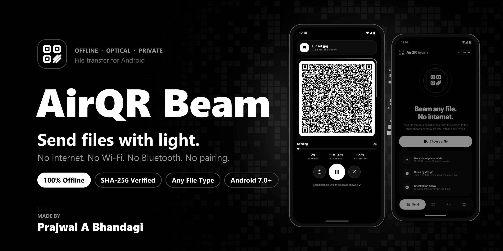
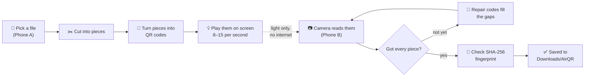

# AirQR Beam

**Send files between two phones using only the screen and the camera.**  
*No internet · No Wi-Fi · No Bluetooth · No pairing · No account · 100% Air-Gapped Optical Transfer*

 

 

---

## 📸 Screenshots

<table>
  <tr>
    <td align="center"> <b>Animated splash</b></td>
    <td align="center"> <b>Home: pick any file</b></td>
    <td align="center"> <b>Choose a speed</b></td>
    <td align="center"> <b>Beaming the file</b></td>
  </tr>
  <tr>
    <td align="center"> <b>Receive with the camera</b></td>
    <td align="center"> <b>Transfer history</b></td>
    <td align="center"> <b>Settings</b></td>
    <td align="center"> <b>About</b></td>
  </tr>
  <tr>
    <td align="center"> <b>Over 100 MB: refused</b></td>
    <td align="center"> <b>Over 2 minutes: refused</b></td>
    <td colspan="2" valign="middle">
      <b>Black &amp; white by design.</b> 
      QR codes scan best at maximum contrast, so the entire app is pure monochrome black and white—from the launcher icon and splash animation to live QR streams and UI controls.
    </td>
  </tr>
</table>

---

## 🧭 How it works (in simple words)

Think of it like a **flip-book of QR codes**.

1. **You pick a file** on Phone A (a photo, PDF, note, APK, anything).
2. **The app cuts the file into small pieces** and turns each piece into a QR code.
3. **Phone A plays the QR codes like a fast slideshow** (8–15 per second).
4. **Phone B points its camera at the screen** and reads the QR codes one by one.
5. **Missed a few? No problem.** After showing every piece once, Phone A streams "repair" codes (fountain codes). Each one can fill in *any* missing piece, so Phone B never waits for the whole slideshow to replay.
6. **Phone B rebuilds the file and checks its fingerprint** (SHA-256). If even one byte were wrong, the file would be rejected. When it matches, you see a ✓ and the file is saved to **Downloads/AirQR**.

Nothing goes through the internet at any point. The file travels only as **light from one screen into one camera**.

```mermaid
flowchart LR
    A["📄 Pick a file<br/>(Phone A)"] --> B["✂️ Cut into pieces"]
    B --> C["🔲 Turn pieces into<br/>QR codes"]
    C --> D["💡 Play them on screen<br/>8–15 per second"]
    D -. "light only,<br/>no internet" .-> E["📷 Camera reads them<br/>(Phone B)"]
    E --> F{"Got every piece?"}
    F -- "not yet" --> G["🔁 Repair codes fill<br/>the gaps"]
    G --> E
    F -- "yes" --> H["🔐 Check SHA-256<br/>fingerprint"]
    H --> I["✅ Saved to<br/>Downloads/AirQR"]
```

---

## 📏 Limits (and why)

QR codes over light are slower than RF radios (Wi-Fi), so AirQR keeps every transfer predictable and swift:

| Rule | What happens |
| :--- | :--- |
| ⏱️ **Must finish within 2 minutes** | The app estimates transfer time before starting and picks the most reliable speed that fits. That is roughly **1 MB** at the fastest speed. |
| 🚫 **Never over 100 MB** | Refused immediately before reading into memory. |
| ☁️ **Bigger files?** | The app suggests online apps instead: **Google Drive, WeTransfer, Telegram, or Gmail**. |

### ⚡ Speeds

| Speed | Frames/sec | Best for |
| :--- | :---: | :--- |
| **Steady** | 8 | Any camera, shaky hands, bright rooms |
| **Balanced** | 12 | Most phones |
| **Turbo** | 15 | Both phones held steady, responsive cameras |
| **Auto** *(default)* | — | Automatically picks the fastest reliable speed that finishes within 2 minutes |

---

## ✨ Features

- ⚡ **100% Offline**: Zero internet permission required; functions completely in Airplane Mode.
- 🌊 **Fountain Repair Codes**: Systematic linear fountain codes mean missed frames don't require restarting.
- 📁 **Any File Type**: Use the built-in file picker, or **Share → Beam with AirQR** from any Android app.
- 🔒 **Dual Integrity Verification**: CRC32 per QR frame + full SHA-256 cryptographic checksum for the reconstructed file.
- 🧩 **Live Visual Feedback**: Chunk heat map, circular progress indicator, current transfer rate, and ETA.
- 📜 **Transfer History**: Complete log of sent and received transfers with direct open, share, and file inspector actions.
- 🖤 **High-Contrast Monochrome UI**: Optimized for camera readability and OLED efficiency with haptic feedback.
- 🔆 **Automatic Brightness Boost**: Temporarily boosts screen brightness during beaming for optimal optical reception.

---

## 📲 Install

1. Download [**AirQR-Beam-v2.0.0.apk**](https://github.com/prajwal032004/qr-optical-beam/releases/download/v2.0.0/AirQR-Beam-v2.0.0.apk) from the [Releases](https://github.com/prajwal032004/qr-optical-beam/releases) page.
2. Open it on your Android phone (Android 7.0 Nougat or newer).
3. If prompted, grant **Install unknown apps** for your browser or file manager.
4. Install it on **both** phones, and you are ready to beam.

> 💡 *Note*: If updating from an earlier v1.x release, uninstall the previous version before installing v2.0.0.

---

## 📖 Step-by-Step Guide

### 📤 Sending (Phone A)
1. Open **Send** and tap **Choose a file**.
2. Select your file and choose a speed. Each option calculates its expected transfer time (options > 2 min are disabled).
3. Tap **Start beaming**. The screen maximizes brightness and begins cycling high-density QR frames.
4. Keep beaming until Phone B confirms completion with a ✓.

### 📥 Receiving (Phone B)
1. Open **Receive** and allow camera access.
2. Align the sender's QR code within the viewfinder at approximately **15–25 cm**. Tap to focus if needed.
3. Watch the chunk heat map fill up in real time.
4. When verification succeeds (✓), tap **Open** or **Share**. The verified file is saved to **Downloads/AirQR**.

---

## ⚔️ Comparison: AirQR Beam vs. Alternative Transfer Methods

| Method | Works Without Internet | Zero Radio Signals (RF) | No Pairing / Accounts | Eavesdropping Resistance | Max Practical Size |
| :--- | :---: | :---: | :---: | :---: | :---: |
| **AirQR Beam** | ✅ | ✅ | ✅ | ✅ (Line-of-sight only) | ~1 MB |
| **Bluetooth** | ✅ | ❌ | ❌ | ❌ | ~50 MB |
| **Wi-Fi Direct / Quick Share** | ✅ | ❌ | ⚠️ | ❌ | Gigabytes |
| **Cloud Storage** | ❌ | ❌ | ❌ | ❌ | Unlimited |

**Best Use Cases:** Secure documents, cryptographic keys, credentials, photos, contact cards, or notes in air-gapped environments, SCIFs, flights without Wi-Fi, or when radio silence is essential.

---

## 🔬 Under the Hood

- **Compact Frame Encoding**: `"AQ2" + Base45(binary frame + CRC32) + "."`. Base45 leverages the QR code's native alphanumeric mode, achieving ~30% higher data density than Base64.
- **Dual Frame Architecture**: 
  - `DATA`: Carries raw payload chunks and fountain repair combinations.
  - `META`: Transmits file metadata (filename, MIME type, size, SHA-256). Broadcasts periodically every 10 frames so the receiver can lock on at any instant.
- **Systematic Fountain Codes**: Repair frames are generated via random linear combinations over $GF(2)$. Seeded pseudo-random generation guarantees synchronized chunk sets between sender and receiver without transmitting chunk indexes.
- **Incremental Gaussian Elimination**: Chunks are resolved on-the-fly over $GF(2)$, allowing each received frame to immediately solve for missing data.
- **Modern Android Stack**: Built with Kotlin, Jetpack Compose (Material 3), CameraX, ZXing, Google ML Kit Barcode Scanning (offline bundled model), Room Database, and Kotlin Coroutines/StateFlow.

---

## 🌐 Web Companion

> ⚠️ The legacy browser companion (`app/src/main/assets/web/index.html`) currently uses the v1 protocol and cannot exchange files with v2.0.0 until updated.

---

## 🔐 Source Code

The core Android application source for AirQR Beam is **private**. To use the application, download and install the signed APK from [Releases](https://github.com/prajwal032004/qr-optical-beam/releases).

---

## 👨‍💻 Author

   
  <b>AirQR Beam</b> 
  Created with precision by 
  <b><a href="https://github.com/prajwal032004">Prajwal A Bhandagi</a></b>

---

## 📄 License

Distributed under the terms specified in [`LICENSE`](LICENSE).
