

  

<h1 align="center">AirQR Beam</h1>

  <b>Send files between two phones using only the screen and the camera.</b> 
  No internet · No Wi-Fi · No Bluetooth · No pairing · No account

  
  
  
  

  
  

---

## 📸 Screenshots

<table>
  <tr>
    <td align="center">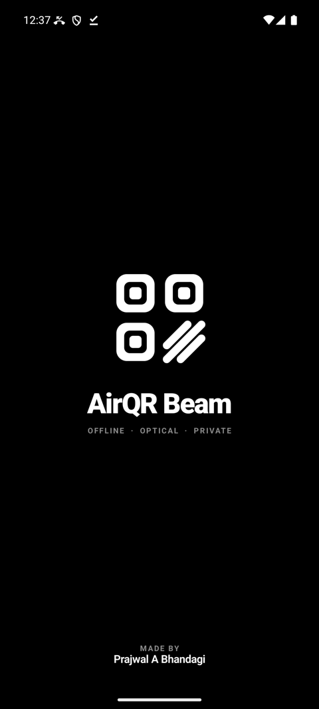 <b>Animated splash</b></td>
    <td align="center">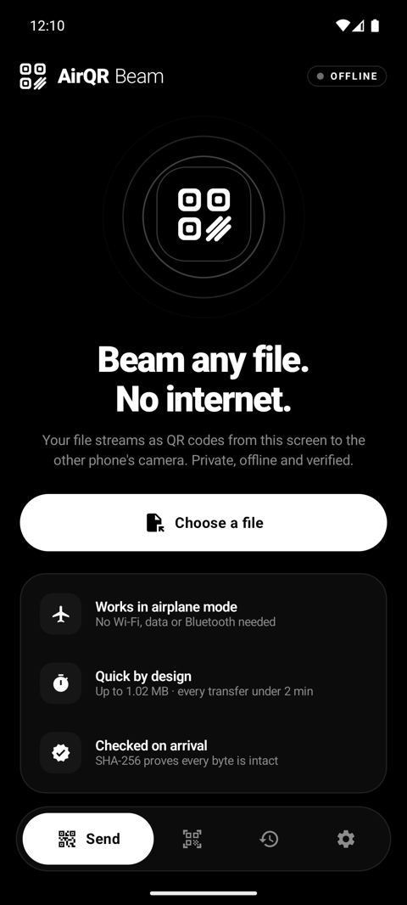 <b>Home: pick any file</b></td>
    <td align="center">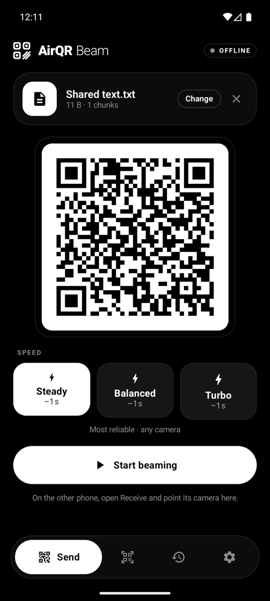 <b>Choose a speed</b></td>
    <td align="center">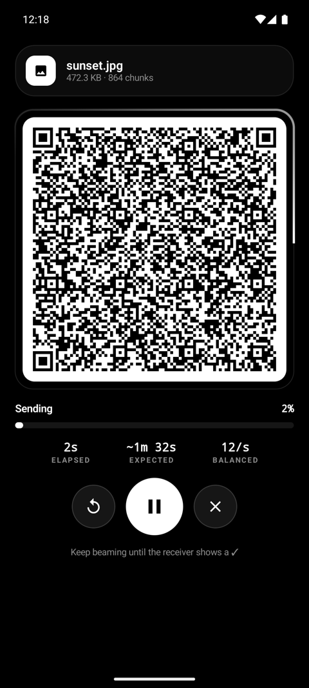 <b>Beaming the file</b></td>
  </tr>
  <tr>
    <td align="center">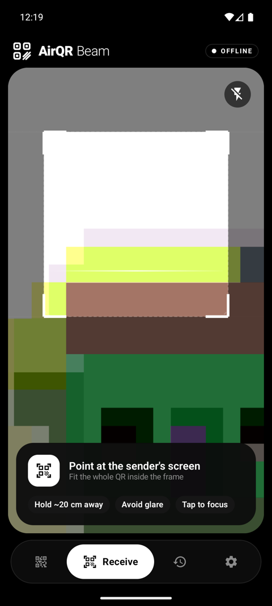 <b>Receive with the camera</b></td>
    <td align="center">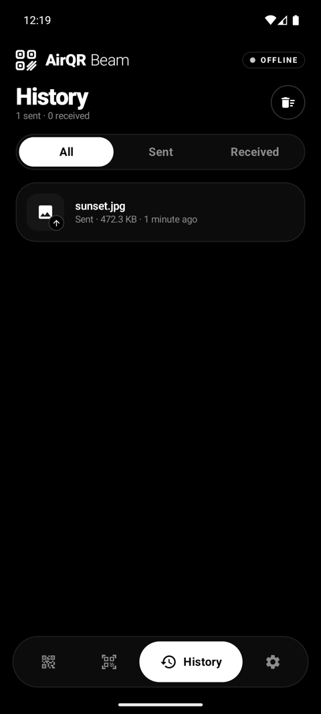 <b>Transfer history</b></td>
    <td align="center">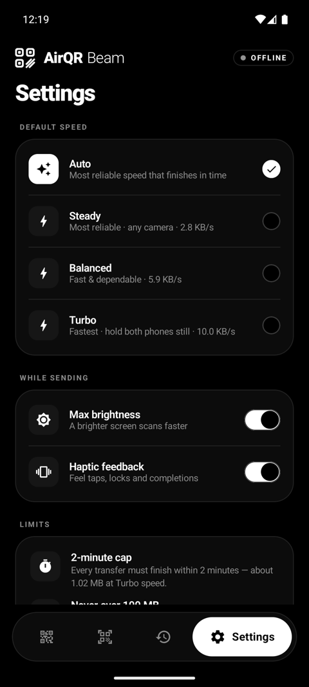 <b>Settings</b></td>
    <td align="center">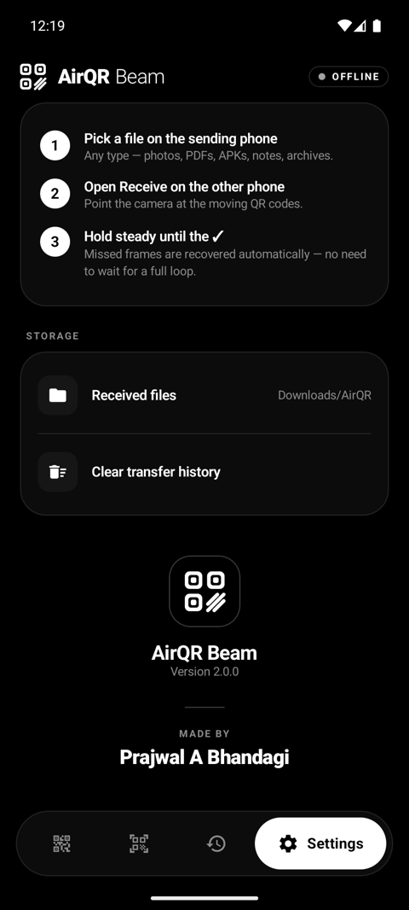 <b>About</b></td>
  </tr>
  <tr>
    <td align="center">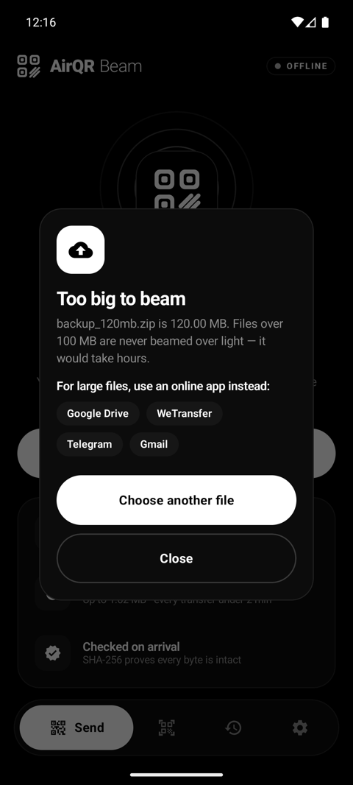 <b>Over 100 MB: refused</b></td>
    <td align="center">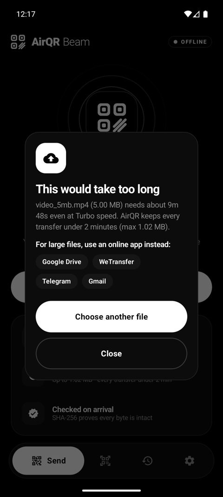 <b>Over 2 minutes: refused</b></td>
    <td colspan="2" valign="middle">
      <b>Black &amp; white by design.</b> 
      QR codes scan best at maximum contrast, so the whole app is pure black and white, from the icon and splash screen to every animation.
    </td>
  </tr>
</table>

---

## 🧭 How it works (in simple words)

Think of it like a **flip-book of QR codes**.

1. **You pick a file** on Phone A (a photo, PDF, note, APK, anything).
2. **The app cuts the file into small pieces** and turns each piece into a QR code.
3. **Phone A plays the QR codes like a fast slideshow** (8–15 per second).
4. **Phone B points its camera at the screen** and reads the QR codes one by one.
5. **Missed a few? No problem.** After showing every piece once, Phone A sends "repair" codes. Each one can fill in *any* missing piece, so Phone B never waits for the whole slideshow to replay.
6. **Phone B rebuilds the file and checks its fingerprint** (SHA-256). If even one byte were wrong, the file would be rejected. When it matches, you see a ✓ and the file is saved to **Downloads/AirQR**.

Nothing goes through the internet at any point. The file travels only as **light from one screen into one camera**.

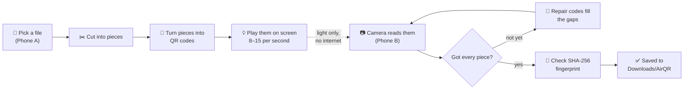
```mermaid
flowchart LR
    A["📄 Pick a file<br/>(Phone A)"] --> B["✂️ Cut into pieces"]
    B --> C["🔲 Turn pieces into<br/>QR codes"]
    C --> D["💡 Play them on screen<br/>8–15 per second"]
    D -. "light only,<br/>no internet" .-> E["📷 Camera reads them<br/>(Phone B)"]
    E --> F{"Got every piece?"}
    F -- "not yet" --> G["🔁 Repair codes fill<br/>the gaps"]
    G --> E
    F -- "yes" --> H["🔐 Check SHA-256<br/>fingerprint"]
    H --> I["✅ Saved to<br/>Downloads/AirQR"]
```

---

## 📏 Limits (and why)

QR codes over light are slow compared to Wi-Fi, so AirQR keeps every transfer quick:

| Rule | What happens |
| :--- | :--- |
| ⏱️ **Must finish within 2 minutes** | The app estimates the time before starting and picks the most reliable speed that fits. That is roughly **1 MB** at the fastest speed. |
| 🚫 **Never over 100 MB** | Refused immediately, before the file is even read. |
| ☁️ **Bigger files?** | The app suggests online apps instead: **Google Drive, WeTransfer, Telegram or Gmail**. |

**Speeds**

| Speed | Frames/sec | Best for |
| :--- | :---: | :--- |
| **Steady** | 8 | Any camera, shaky hands, bright rooms |
| **Balanced** | 12 | Most phones |
| **Turbo** | 15 | Both phones held still, good cameras |
| **Auto** *(default)* | — | Picks the most reliable speed that finishes within 2 minutes |

---

## ✨ Features

- ⚡ **100% offline**: the app has no internet permission at all, so it works in airplane mode.
- 🌊 **Quick transfer with repair codes**: a few missed frames never mean starting over.
- 📁 **Any file type**: use the file picker, or **Share → Beam with AirQR** from any app (shared text becomes a `.txt` file).
- 🔒 **Double integrity check**: every QR frame has a CRC32 check, and the whole file has a SHA-256 fingerprint.
- 🧩 **Live progress**: a chunk heat map, progress ring, speed and time left while receiving.
- 📜 **History**: see everything sent and received; open, share or inspect files.
- 🖤 **Black & white design**: animated splash, floating navigation bar, smooth screen transitions and haptic feedback.
- 🔆 **Auto max brightness** while sending, so the other camera reads faster.

---

## 📲 Install

1. Download [**AirQR-Beam-v2.0.0.apk**](https://github.com/prajwal032004/qr-optical-beam/releases/download/v2.0.0/AirQR-Beam-v2.0.0.apk) from the [Releases](https://github.com/prajwal032004/qr-optical-beam/releases) page.
2. Open it on your Android phone (Android 7.0 or newer).
3. If asked, allow **Install unknown apps** for your browser or file manager.
4. Install it on **both** phones, and you're ready.

> If you had an older version (v1.x) installed and the update fails, uninstall the old version first.

---

## 📖 Step-by-step guide

### 📤 Sending (Phone A)
1. Open **Send** and tap **Choose a file**.
2. Check the speed. Each option shows its estimated time; options over 2 minutes are disabled.
3. Tap **Start beaming**. The screen goes full brightness and the menus hide.
4. Keep beaming until Phone B shows a ✓.

### 📥 Receiving (Phone B)
1. Open **Receive** and allow the camera.
2. Fit the whole QR code inside the frame, about **20 cm** away. Tap the screen to focus and avoid glare.
3. Watch the heat map fill up.
4. When the ✓ appears, tap **Open** or **Share**. The file is already saved in **Downloads/AirQR**.

---

## ⚔️ AirQR Beam vs other ways to share

| | **AirQR Beam** | Bluetooth | Wi-Fi Direct / Quick Share | Cloud apps |
| :--- | :---: | :---: | :---: | :---: |
| Works without internet | ✅ | ✅ | ✅ | ❌ |
| No radio signals at all | ✅ | ❌ | ❌ | ❌ |
| No pairing or account | ✅ | ❌ | ⚠️ | ❌ |
| Can only be "overheard" by line of sight | ✅ | ❌ | ❌ | ❌ |
| Good for large files | ❌ (≤ ~1 MB) | ⚠️ | ✅ | ✅ |

**Great for:** sharing a document, photo, key file or note in airplane mode, in a room with no signal, or anywhere you don't want to connect two devices.

---

## 🔬 Under the hood (for the curious)

- **Frames**: `"AQ2" + Base45(binary frame + CRC32) + "."`. Base45 lets the QR use its compact *alphanumeric* mode, which fits about 30% more data per code than Base64 text.
- **Two frame types**: `DATA` (one piece or one repair mix) and `META` (file name, type, size, SHA-256). META repeats every 10 frames, so the receiver can start scanning at any moment.
- **Repair codes** are a *systematic random linear fountain code*: each repair frame is the XOR of a pseudo-random set of pieces chosen from the frame number, so both phones agree on it without sending the list.
- **Decoding** uses incremental Gaussian elimination over GF(2), so every useful frame solves one more unknown piece.
- **Stack**: Kotlin, Jetpack Compose (Material 3), CameraX, ML Kit barcode scanning (bundled model, works offline), ZXing, Room, Coroutines/StateFlow.

---

## 🌐 Web companion

> ⚠️ The browser companion (`app/src/main/assets/web/index.html`) still uses the original v1 frame format and **cannot exchange files with app v2.0.0** until it is updated.

---

## 🔐 Source code

The Android source code for this app is **not published** in this repository. To use the app, install the APK from [Releases](https://github.com/prajwal032004/qr-optical-beam/releases).

---

## 📄 License

See [`LICENSE`](LICENSE).

   
  MADE BY 
  <b>Prajwal A Bhandagi</b>

